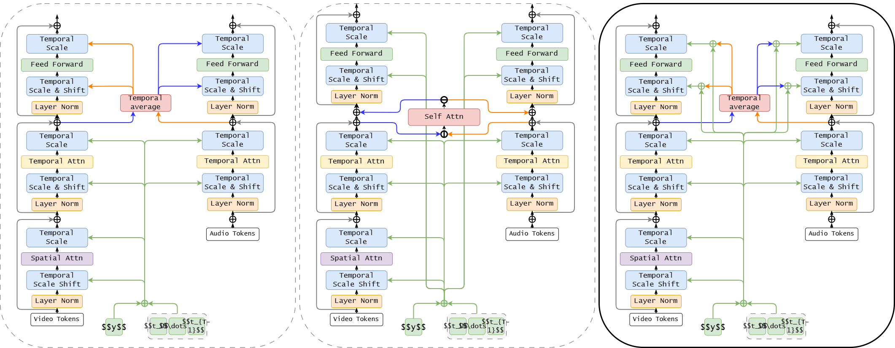

# TECMO: Efficient Temporal Cross-interaction Module for long synchronized Audio-Video generation

This is the official implementation of [R-FLAV: Rolling Flow matching for infinite Audio Video generation](https://arxiv.org/abs/2503.08307)

An overview of our models is shown here: $^R$-FLAV: Rolling Flow mathcing for infinite Audio Video generation.

<center></center>


In our paper we explores three different model configuration, illustrated here:
<center></center>

## Demo
Try out our demo for free without any requirements on [Hugging Face](https://huggingface.co/spaces/MaverickAlex/R-FLAV)🤗

## Results

### Examples of short video generated on AIST and Landscape

https://github.com/user-attachments/assets/d7d544d0-7c62-4870-b783-4f0efa8eebee

https://github.com/user-attachments/assets/aa6e0dfa-cbee-4127-b4e6-c96386cc0870

https://github.com/user-attachments/assets/027f8a5a-ba7f-404b-863b-f3fabbcad9a6

https://github.com/user-attachments/assets/0cbbdd84-393d-4d7b-af82-537a4398d2d1


### Examples of long video generated on AIST 

https://github.com/user-attachments/assets/233661cd-1cc0-4759-83be-faff0c988151

https://github.com/user-attachments/assets/5223acf3-04bc-4d34-924d-c7483e07f1e2

## Setup

Create conda env:
```bash
conda create -y -n FLAV python=3.12
conda activate FLAV
conda install -y pytorch torchvision torchaudio pytorch-cuda=12.4 -c pytorch -c nvidia
pip install pysoundfile transformers diffusers einops accelerate librosa timm
pip install onnx onnxruntime onnxsim omegaconf
pip install moviepy
pip install pyav
pip install git+https://github.com/facebookresearch/segment-anything.git
```

## Inference
Checkpoints are available at Hugging Face🤗 and can be directly 

| Model | Link |
|-|-|
| AIST | https://huggingface.co/MaverickAlex/R-FLAV-B-1-AIST |
| Landscape | https://huggingface.co/MaverickAlex/R-FLAV-B-1-LS |

download using:

```python
from huggingface_hub import hf_hub_download
import torch

model_ckpt = "MaverickAlex/R-FLAV-B-1-AIST" # MaverickAlex/R-FLAV-B-1-LS

model = FLAV.from_pretrained(model_ckpt)

hf_hub_download(repo_id=model_ckpt, filename="vocoder/config.json")
vocoder_path = hf_hub_download(repo_id=model_ckpt, filename="vocoder/vocoder.pt")
vocoder_path = vocoder_path.replace("vocoder.pt", "")
vocoder = Generator.from_pretrained(vocoder_path)
```

Sampling command:
```bash
python sample-metrics.py \
    --model-ckpt MaverickAlex/R-FLAV-B-1-AIST \
    --results-dir results \
    --video-length 16 \
    --num-videos 2048 \
    --audio-scale <audio-scale> \
    --num-timesteps 2
```

```bash
python sample-metrics-a2v.py \
    --model-ckpt MaverickAlex/R-FLAV-B-1-AIST \
    --results-dir results \
    --video-length 16 \
    --num-videos 2048 \
    --num-timesteps 2 \
    --data-path ...
```

## Training
```bash
accelerate launch --multi_gpu --num_processes=... \
        train.py \
        --model FLAV-B/1 \
        --data-path <datapath> \
        --image-size 256 \
        --batch-size 16 --num-classes <classes> \
        --experiment-dir <experiment-dir> \
        --results-dir results/ \
        --sample-every 20000 \
        --ckpt-every 5000 \
        --log-every 100 \
        --video-length 50 \
        --predict-frames 10 \
        --sampling logit \
        --num-workers 16 \
        --grad-ckpt \
        --causal-attn \
        --use_sd_vae \
        --audio-scale <audio-scale>
```

Where `<datapath>` is the dataset folder organised as follow:

If the dataset does not have classes:
```
dataset-folder:
 ├──train
 │   ├──file1.mp4
 │   ├──file2.mp4
 └──test
     └──file3.mp4
```
If the dataset does have classes:
```
dataset-folder:
 ├──train
 │   ├──class0
 │   │  └──file1.mp4
 │   └──class1
 │      └──file2.mp4
 └──test
     ├──class0
     │  └──file3.mp4
     └──class1
        └──file4.mp4
```
`<classes>` is the number of classes in the dataset.

`<audio-scale>` is:
- For AIST++: `3.5009668382765917` 
- For landscape: `3.0951129410195515`


## Citation

```
@misc{ergasti2025rflavrollingflowmatching,
      title={$^R$FLAV: Rolling Flow matching for infinite Audio Video generation}, 
      author={Alex Ergasti and Giuseppe Gabriele Tarollo and Filippo Botti and Tomaso Fontanini and Claudio Ferrari and Massimo Bertozzi and Andrea Prati},
      year={2025},
      eprint={2503.08307},
      archivePrefix={arXiv},
      primaryClass={cs.CV},
      url={https://arxiv.org/abs/2503.08307}, 
}
```

## Ack

Our code is inspired by [DiT](https://github.com/facebookresearch/DiT)
